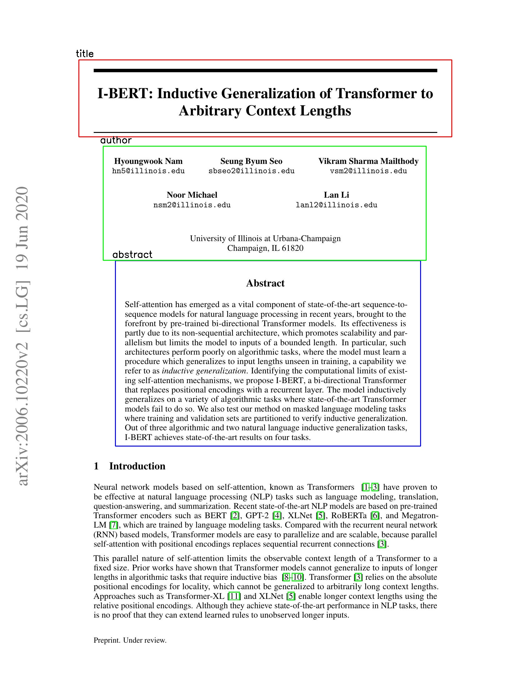

# Research Paper Segmentation

Bruno Seo, Michal Gryga

### Tutorial

1) Please clone this repository into your local computer

```bash
git clone https://github.com/sbseo/research_paper_segmentation.git
```

2) Run `evaluation.ipynb` to segment the paper. Sample outcomes are available in the code.

- If you would like to add a custom research paper, feel free to add `{i}.jpg` in `/tst/` folder. e.g.  `/tst/5.jpg`

### Outcome





### References

This research was supported by Prof. Darek Hoiem as a part of CS445 Computational Photography final project.

- PyTorch Tutorial: https://pytorch.org/tutorials/intermediate/torchvision_tutorial.html
- Object Detection with Faster RCNN: https://blog.francium.tech/object-detection-with-faster-rcnn-bc2e4295bf49
- Text Detection by Faster R-CNN with Multiple Region Proposal Networks, Nagaoka et al., 2017
- Faster R-CNN: Towards Real-Time Object Detection with Region Proposal Networks, Ren et al., 2016